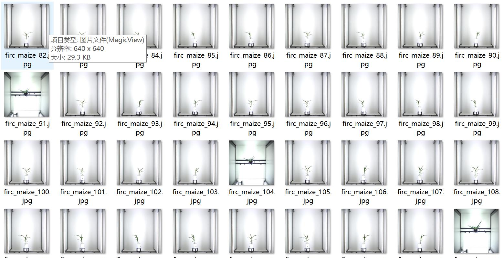
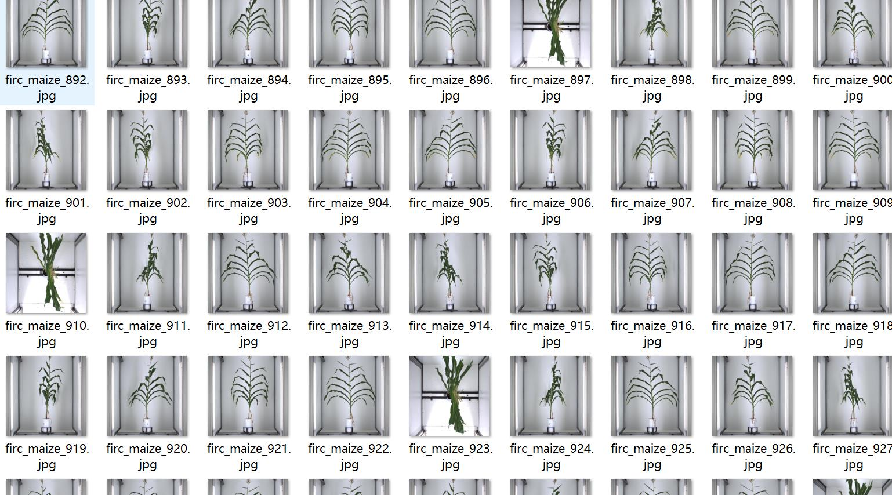
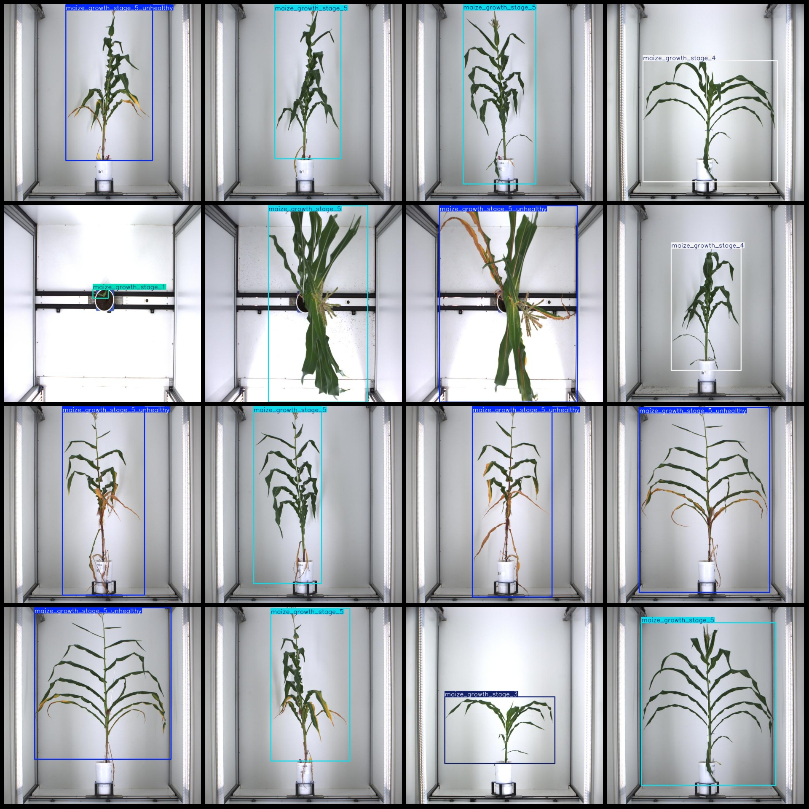
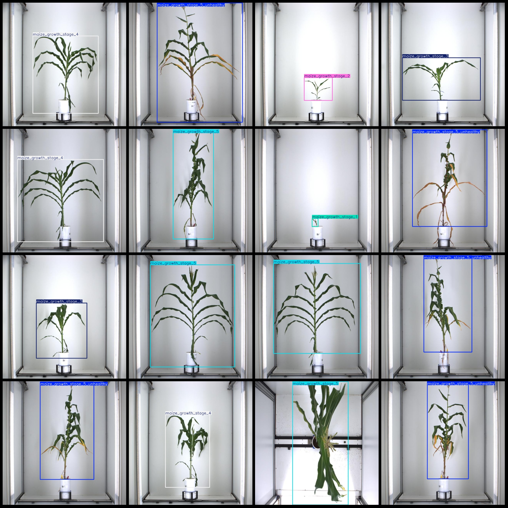

# Corn Plant Growth Stages Detection Dataset VOC+YOLO Format, 1482 Images, 6 Categories

The dataset format is Pascal VOC format plus YOLO format (without split path in txt file, only containing jpg images and corresponding VOC format xml files and yolo format txt files). 

Image count (number of jpg files): 1482
Annotation count (number of xml files): 1482
Annotation count (number of txt files): 1482
Number of categories: 6

Note that the order of labels in the YOLO format does not correspond to this list. It should be based on the "labels" folder's "classes.txt".

Each category has the following number of bounding boxes:
maize_growth_stage_1 (corn growth stage 1) = 51
maize_growth_stage_2 (corn growth stage 2) = 137
maize_growth_stage_3 (corn growth stage 3) = 197
maize_growth_stage_4 (corn growth stage 4) = 281
maize_growth_stage_5 (corn growth stage 5) = 312
maize_growth_stage_5_unhealthy (corn growth stage 5 unhealthy) = 504
Total bounding box count: 1482

Each category occupies the number of images:
maize_growth_stage_1 (corn growth stage 1) = 51
maize_growth_stage_2 (corn growth stage 2) = 137
maize_growth_stage_3 (corn growth stage 3) = 197
maize_growth_stage_4 (corn growth stage 4) = 281
maize_growth_stage_5 (corn growth stage 5) = 312
maize_growth_stage_5_unhealthy (corn growth stage 5 unhealthy) = 504

Image resolution: 640x640

Annotation tool used: labelImg
Annotation rule: draw a rectangular box around each class

Important note: The dataset does not have been divided into training/validation/test sets; please do it yourself.
Special declaration: This dataset does not guarantee the accuracy of the trained models or weight files.

Image preview:
## Images

Here is a pay link on Stripe ( https://buy.stripe.com/3cs8yP7sY87d0vu9AB ). Please contact me lonlonago@foxmail.com after funding $89, and I will send you a complete data files , thank you!

